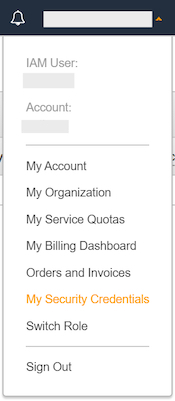
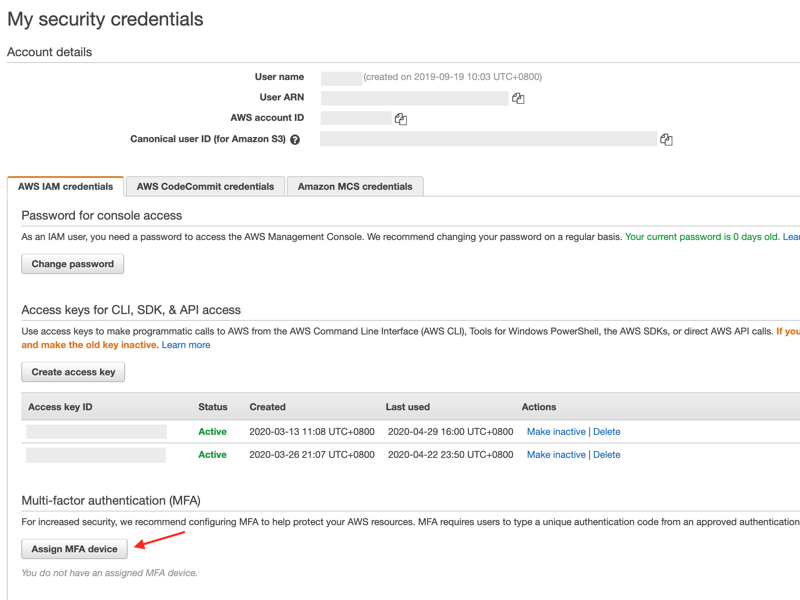
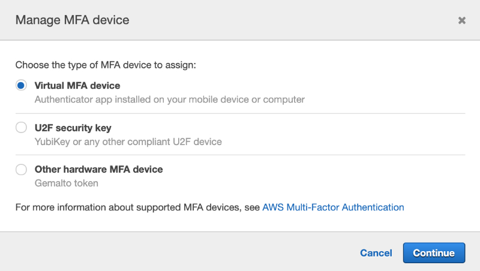
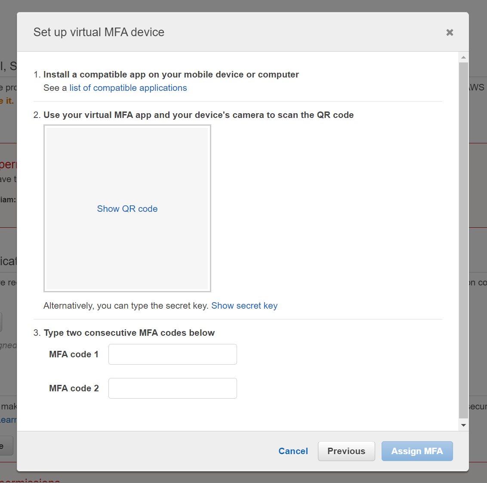
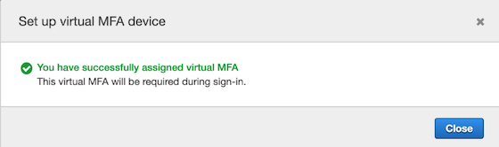

# AWS MFA

## Enable MFA for AWS Console Login
1. You require a phone as a virtual multi-factor authentication (MFA) device. To do this, install a MFA app, like [Google Authenticator](https://play.google.com/store/apps/details?id=com.google.android.apps.authenticator2&hl=en). These app generates a six-digit authentication code.
1. Sign in to the AWS Management Console. Go the **Security Credentials** page.

1. Under **Muti-factor authentication (MFA)**, choose **Assign MFA device**.

1. Choose **Virtual MFA device** → **Continue**.

1. Choose **Show QR code**. Use the app to scan the QR code. The app starts generating six-digit numbers.
Enter the first six-digit number displayed on app into the **MFA code 1**. 
Wait for a while for it to generate new number, put it in **MFA code 2**.
Click **Assign MFA**.

1. You will see a success page if setup is ok.


## Remove MFA
MFA need to be deactivate first before remove.
```
aws iam deactivate-mfa-device --user-name <username> --serial-number arn:aws:iam::083584264446:mfa/<username>
aws iam delete-virtual-mfa-device --serial-number arn:aws:iam::083584264446:mfa/<username>
```